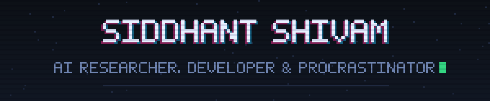
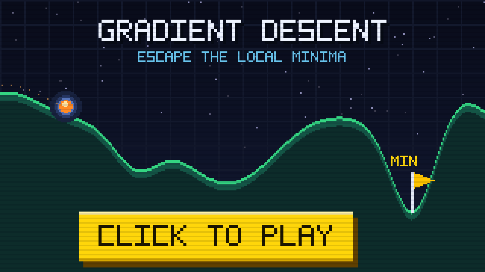
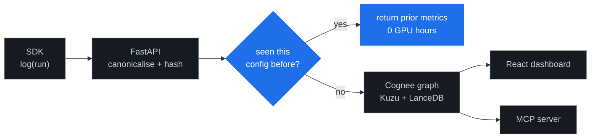

---

### hi, i'm siddhant

- 🧠 &nbsp;**AI Researcher** at Mars Rover Manipal, working on vision and language models
- 🎓 &nbsp;**B.Tech Information Technology** at Manipal Institute of Technology
- 🗂 &nbsp;**Membership Chairperson** at the ACM Manipal Student Chapter
- 🕹 &nbsp;I made a tiny game called **Gradient Descent**. It is about local minima, which is also what most of my week is about.

> [!NOTE]
> **Currently chasing:** representation transfer. How much a frozen transformer already
> understands about a domain nobody trained it on, and whether that knowledge survives
> being moved to time series forecasting. Early answer: more than it has any right to.

---

## what i've built

<b>Groundhog</b> &nbsp;persistent memory for ML experiments &nbsp;<code>expand</code>

 

Named for the film, because that is what running experiments feels like. The same day,
forever, with slightly different hyperparameters.

- Designed the memory graph schema in **Cognee**: typed nodes for experiments, datasets,
  artifacts and hypotheses, joined by lineage edges, with subagents handling config
  resolution, failure analysis and literature research.
- Built config canonicalisation and hashing on **FastAPI**, with duplicate detection that
  returns the earlier run's metrics instead of burning four more GPU hours proving the
  same thing twice.
- Shipped a **Python SDK**, a **React + Recharts** dashboard for parameter sensitivity
  analysis, and an **MCP server** exposing duplicate config checks and lineage lookup.

<b>Synapse</b> &nbsp;MCP driven browser automation &nbsp;<code>expand</code>

 

A Chrome extension that lets an agent finish the boring half of the internet.

- Designed the orchestrator schema and tool coordination logic on **FastMCP**, with GitHub
  and Notion MCP servers as the first multi app integration targets.
- Used **LangGraph** for stateful multi step orchestration, covering OTP retrieval,
  document understanding and form filling.
- Shipped as a **Chrome Extension** with secure credential management, because an agent
  holding your passwords deserves more scrutiny than one holding your calendar.

<b>GANs from scratch</b> &nbsp;generative modelling and transfer learning &nbsp;<code>expand</code>

 

- Implemented a full GAN pipeline in **PyTorch** on MNIST: generator and discriminator
  architecture, the adversarial training loop, and honest mode collapse diagnostics.
- Fine tuned **StyleGAN3** on a large image dataset, then ran latent space exploration and
  representation analysis for transfer learning experiments.
- Turned it into a hands on workshop for **50+ participants**, covering the training
  strategies that actually work rather than the ones in the paper.

<b>Gradient Descent</b> &nbsp;the game above &nbsp;<code>expand</code>

 

A pixel game about the thing that ruins training runs. A ball rolls down a loss landscape
and will happily settle in the first valley it finds. Your steering is capped, so it cannot
climb a real ridge. Escaping costs momentum, and momentum is limited.

Three landscapes, no engine, no dependencies. Plain canvas and about four hundred lines.
Every level was tuned against a physics simulation to guarantee three things: doing nothing
always ends trapped, level one is solvable by steering alone, and levels two and three
cannot be solved without spending momentum.

<b>Open source</b> &nbsp;30+ commits to <code>coral/coral</code> &nbsp;<code>expand</code>

 

Two merged pull requests, [#1058](https://github.com/withcoral/coral/pull/1058) and
[#1066](https://github.com/withcoral/coral/pull/1066), adding Chromium and Firefox source
support and improving compatibility across non WebKit engines.

---

## where it went well

| | | |
|:--|:--|:--|
|  | **Samsung PRISM Hackathon** `2025-26` | 450+ participants |
|  | **Hack-Some-Thorns**, Best Project, IECSE Manipal | |
|  | **HackIndia x Adaption Labs**, AI Agent track | 425 teams |
|  | **The Earth Prize**, scholars worldwide `2022` | 625 teams |

Also: a **Machine Learning workshop for 50+ students**, and the backend for **Cached CTF**
at Tech Tatva, running live leaderboard tracking for 200+ participants.

 

  

*"the model is not the product. the loop around it is."*

