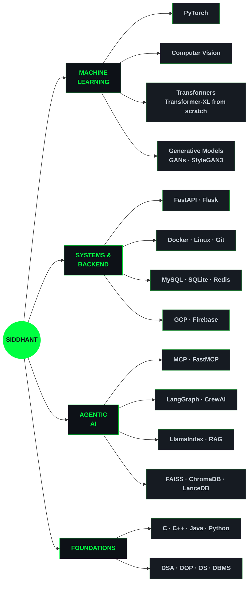
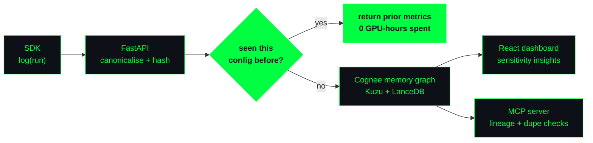
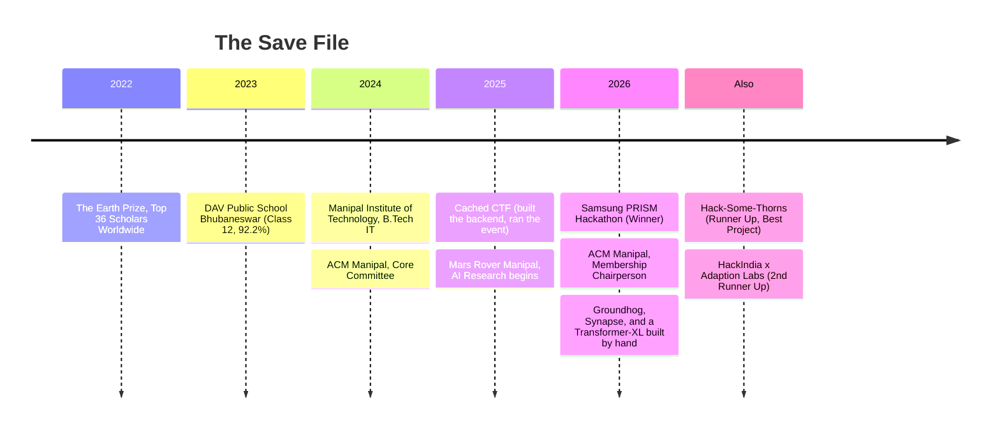

<div align="center">


</div>

```
█████ █████ ████  ████  █   █  ███  █   █ █████
█       █   █   █ █   █ █   █ █   █ ██  █   █
█       █   █   █ █   █ █   █ █   █ ██  █   █
█████   █   █   █ █   █ █████ █████ █ █ █   █
    █   █   █   █ █   █ █   █ █   █ █  ██   █
    █   █   █   █ █   █ █   █ █   █ █  ██   █
█████ █████ ████  ████  █   █ █   █ █   █   █

█████ █   █ █████ █   █  ███  █   █
█     █   █   █   █   █ █   █ ██ ██
█     █   █   █   █   █ █   █ █ █ █
█████ █████   █   █   █ █████ █ █ █
    █ █   █   █   █   █ █   █ █   █
    █ █   █   █    █ █  █   █ █   █
█████ █   █ █████   █   █   █ █   █
```

<div align="center">

<a href="https://github.com/sidshivam625"></a>
<a href="https://linkedin.com/in/siddhantshivam"></a>
<a href="mailto:siddhantshivam198@gmail.com"></a>


<br><br>

**[ PLAYER CARD ](#-player-card)** · **[ INVENTORY ](#-inventory)** · **[ SKILL TREE ](#-skill-tree)** · **[ HIGH SCORES ](#-high-scores)** · **[ QUEST LOG ](#-quest-log)** · **[ ARTIFACTS ](#-artifacts-forged)** · **[ ⚔ THE DUNGEON ⚔ ](#the-dungeon-of-the-eternal-build)**

</div>

---

## ▸ BOOT SEQUENCE

```yaml
> initializing siddhant.exe ...
> loading personality module ......... OK
> mounting /dev/coffee ............... OK
> checking gpu availability .......... 1 x borrowed, 47 min remaining
> restoring context from last night .. FAILED (as usual)
> ready.

$ whoami

  name:      Siddhant Shivam
  location:  Manipal, Karnataka  <-  Bhubaneswar, Odisha
  role:      AI Researcher @ Mars Rover Manipal
  degree:    B.Tech, Information Technology (CGPA 8.51)
  focus:     [ language models, computer vision, agentic systems ]
  building:  persistent memory for machine learning experiments
  believes:  "the model is not the product. the loop around it is."
```

> [!NOTE]
> **Current obsession:** representation transfer, and what a frozen transformer
> already knows about a domain it was never trained on. Turns out: more than it should.

---

## ▸ PLAYER CARD

<div align="center">


</div>

<details>
<summary><b>&nbsp;▸ EXPAND STAT BLOCK</b></summary>

<br>

| STAT | VALUE | NOTES |
|:--|:--|:--|
| `HACKATHONS_WON` | **1** | Samsung PRISM 2025-26, from a field of 450+ |
| `PODIUM_FINISHES` | **3** | Winner, 2nd Runner-Up, Runner-Up |
| `PEOPLE_TAUGHT` | **100+** | Two workshops: Machine Learning, and GANs |
| `EVENT_HEADCOUNT` | **200+** | Cached CTF, Tech Tatva; backend built solo |
| `MERGED_PRs_OSS` | **2** | 30+ commits into `coral/coral` |
| `MODELS_TRAINED_FROM_SCRATCH` | **2** | Transformer-XL, and a GAN that eventually behaved |
| `MODE_COLLAPSES_SURVIVED` | `NaN` | counter overflowed |
| `AVG_SLEEP_DURING_DEADLINE` | `4.2h` | optimistic estimate |

</details>

---

## ▸ INVENTORY

> *Adventurers are advised to memorise their inventory. It has a habit of mattering later.*

| SLOT | ITEM | EFFECT |
|:--:|:--|:--|
| `01` | **Rubber Duck of Debugging** | *Legendary.* Listens without judgement. Never leaves my side. |
| `02` | Mechanical Keyboard `+2` | Loud enough to be heard through a wall. Intimidates bugs. |
| `03` | The Ctrl+Z Amulet | Undoes one (1) catastrophic decision. Single use. Already used. |
| `04` | Terminal, Dark Theme Only | Light mode causes `-10` to constitution. |
| `05` | Thermos of Cold Coffee | Was hot four hours ago. Still counts. |
| `06` | A Tab Labelled `arxiv.org` | Has been open since March. Unread. Load-bearing. |

---

## ▸ SKILL TREE



<details>
<summary><b>&nbsp;▸ FULL TECHNOLOGY MANIFEST</b></summary>

<br>

**Languages**
<br>


**ML / Scientific**
<br>


**AI Infrastructure**
<br>


**Backend & Platform**
<br>


**Coursework**: Operating Systems · Data Structures & Algorithms · OOP · DBMS · Machine Learning · Computer Vision · Artificial Intelligence

</details>

---

## ▸ HIGH SCORES

```
╔════════════════════════════════════════════════════════════════════════════╗
║  RANK   ACHIEVEMENT                                    FIELD        SEASON ║
╠════════════════════════════════════════════════════════════════════════════╣
║  1ST    Samsung PRISM Hackathon                        450+ entrants 25-26 ║
║  3RD    HackIndia x Adaption Labs - AI Agent Track     425 teams       --  ║
║  2ND    Best Project, Hack-Some-Thorns (IECSE Manipal) --              --  ║
║  T36    The Earth Prize - Top 36 Scholars Worldwide    625 teams      2022 ║
╚════════════════════════════════════════════════════════════════════════════╝
                          >  ENTER INITIALS:  S S _
```

---

## ▸ QUEST LOG

<details open>
<summary><b>&nbsp;▸ [ACTIVE] &nbsp;AI Researcher · Mars Rover Manipal &nbsp;&nbsp;<code>Dec 2025 → present</code></b></summary>

<br>

Research-track member of Manipal's rover team, working on the perception and language side.

- Built a **Transformer-XL language model from scratch**: architecture, segment-level recurrence, relative positional encoding, the full training loop.
- Investigating **frozen-layer transferability**: how much of a pretrained transformer's learned representation survives when it is redeployed onto time-series forecasting without fine-tuning.
- Working through core ML and DL foundations with a deliberate bias toward computer vision and language modelling.

</details>

<details>
<summary><b>&nbsp;▸ [ACTIVE] &nbsp;Membership Chairperson · ACM Manipal Student Chapter &nbsp;&nbsp;<code>Aug 2026 → present</code></b></summary>

<br>

Two years in the chapter, one on core committee, now holding the membership portfolio.

- Own the technical and logistical operations behind chapter events.
- Delivered a **Machine Learning workshop to 50+ students**.
- Currently running recruitment and redesigning the chapter's domain structure.

*Previously: Core Committee, Sep 2024 - Aug 2026.*

</details>

<details>
<summary><b>&nbsp;▸ [CLEARED] &nbsp;Organising Team · Cached CTF, Tech Tatva &nbsp;&nbsp;<code>2025</code></b></summary>

<br>

Ran a capture-the-flag event end to end for a **200+ participant** base.

- Directed logistics, registrations, and participant onboarding.
- **Engineered the event's backend platform**: real-time leaderboard tracking and participant data management.
- Held the whole thing together from registration through final results without a single leaderboard desync.

</details>

<details>
<summary><b>&nbsp;▸ [ONGOING] &nbsp;Open Source · <code>coral/coral</code></b></summary>

<br>

**30+ commits across 2 merged pull requests**: [`#1058`](https://github.com/withcoral/coral/pull/1058) · [`#1066`](https://github.com/withcoral/coral/pull/1066)

Added Chromium and Firefox source support and improved compatibility across non-WebKit engines. Stack: Coral, SQLite, Python HTTP server.

</details>

---

## ▸ ARTIFACTS FORGED

<details open>
<summary><b>&nbsp;⚙ &nbsp;GROUNDHOG</b> &nbsp;·&nbsp; <i>persistent memory for ML experiments</i></summary>

<br>

     

Named for the film, because that is what running experiments feels like: the same day, forever, with slightly different hyperparameters.

- Designed the **memory graph schema in Cognee**: typed nodes for experiments, datasets, artifacts and hypotheses, linked by lineage edges, and orchestrated subagents for config resolution, failure analysis and literature research.
- Built **config canonicalisation and hashing** on FastAPI, with duplicate-experiment detection that returns the prior run's metrics instead of burning another four GPU-hours proving the same thing twice.
- Shipped a **Python SDK**, a **React + Recharts dashboard** for run logging and parameter-sensitivity analysis, and an **MCP server** exposing duplicate-config checks and lineage lookup to any agent that asks.



</details>

<details>
<summary><b>&nbsp;⚙ &nbsp;SYNAPSE</b> &nbsp;·&nbsp; <i>MCP-driven browser automation</i></summary>

<br>

    

A Chrome extension that lets an agent actually finish the boring half of the internet.

- Designed the **orchestrator schema and tool-coordination logic** on FastMCP, with GitHub and Notion MCP servers as the primary multi-app integration targets.
- Used **LangGraph** for stateful multi-step orchestration, shipping automations for OTP retrieval, document understanding and form filling.
- Delivered through a **Chrome Extension** with secure credential management, because an agent with your passwords deserves more scrutiny than an agent with your calendar.

</details>

<details>
<summary><b>&nbsp;⚙ &nbsp;GANs FROM SCRATCH &nbsp;+&nbsp; TRANSFER LEARNING</b></summary>

<br>

 

- Implemented a **complete GAN pipeline in PyTorch** on MNIST: generator and discriminator architecture, the adversarial training loop, and honest mode-collapse diagnostics.
- **Fine-tuned StyleGAN3** on a large image dataset, then ran latent-space exploration and representation analysis for transfer-learning experiments.
- Turned the whole thing into a **hands-on generative modelling workshop for 50+ participants**, covering the training strategies that actually work rather than the ones in the paper.

</details>

---

## ▸ TIMELINE



---

## ▸ ACTIVITY

<div align="center">


</div>

---

## THE DUNGEON OF THE ETERNAL BUILD

```
                     ▄▄▄▄▄▄▄▄▄▄▄▄▄▄▄▄▄▄▄▄▄▄▄▄▄▄▄
                   ▄█ ░░░░░░░░░░░░░░░░░░░░░░░░░░ █▄
                 ▄█ ░░  ▄▄▄▄▄▄▄▄▄▄▄▄▄▄▄▄▄▄▄▄▄  ░░ █▄
                 █ ░░  █                     █  ░░ █
                 █ ░░  █    T H E            █  ░░ █
                 █ ░░  █      D U N G E O N  █  ░░ █
                 █ ░░  █                     █  ░░ █
                 █ ░░  █▄▄▄▄▄▄▄▄▄▄▄▄▄▄▄▄▄▄▄▄▄█  ░░ █
                 ▀█ ░░░░░░░░░░░░░░░░░░░░░░░░░░░ █▀
                   ▀█▄▄▄▄▄▄▄▄▄▄▄▄▄▄▄▄▄▄▄▄▄▄▄▄▄█▀
```

> **THE LEGEND.** Deep beneath the campus lies a vault sealed by the last engineer who
> ever got a build to pass on the first try. Four floors stand between you and it.
> Each floor yields one digit of the vault code. Assemble all four and the vault opens.
>
> **HOW TO PLAY.** Click a door to open it. There is exactly one correct path down.
> Read the inscriptions. Every floor can be solved by reasoning, not by guessing.
> Choose wrong and you die, but death here is cheap: a link returns you to the gate.
>
> ```
>  RULES:  ▸ 4 floors    ▸ 1 digit per floor    ▸ 0 save points
>  MOTTO:  "it worked on my machine" is not a valid last request
> ```

<br>

### ▚ FLOOR I · THE GATE OF THREE

*Three gates stand in the rock. Carved above them, in a hand long dead:*

> **"Only the gate that never sleeps will admit the living."**

<details>
<summary>&nbsp;<b>▸ THE GATE OF IRON</b> &nbsp;·&nbsp; <i>"I rest when the sun sets."</i></summary>

<br>

```
        _______
       /       \
      |  ✕   ✕  |
      |    ▄    |
      |  ▀▀▀▀▀  |
       \_______/

      Y O U   D I E D
```

The iron gate grinds open onto nothing at all. You fall for what feels like a
sprint review. The gate, true to its word, was asleep.

**[ ↺ RESTART FROM THE GATE ](#the-dungeon-of-the-eternal-build)**

</details>

<details>
<summary>&nbsp;<b>▸ THE GATE OF BONE</b> &nbsp;·&nbsp; <i>"I rest when the moon rises."</i></summary>

<br>

```
   ┌──────────────────────────────────────────────────┐
   │   The bone gate swings open.                     │
   │   No spikes. No pit. A corridor, sloping down.   │
   │   This feels, briefly, like progress.            │
   └──────────────────────────────────────────────────┘
```

*It is not progress. But you were not going to find that out by standing still.*

The corridor ends at two doors. Neither has an inscription.

<details>
<summary>&nbsp;&nbsp;<b>▸ THE LEFT DOOR</b></summary>

<br>

```
      ✕   ✕      Y O U   D I E D
        ▄
      ▀▀▀▀▀
```

The moon rose an hour ago. The gate behind you fell asleep, as promised, and
sealed the corridor. The left door opens onto the inside of the mountain.

*A gate that rests is a gate that traps. The inscription was not decoration.*

**[ ↺ RESTART FROM THE GATE ](#the-dungeon-of-the-eternal-build)**

</details>

<details>
<summary>&nbsp;&nbsp;<b>▸ THE RIGHT DOOR</b></summary>

<br>

```
      ✕   ✕      Y O U   D I E D
        ▄
      ▀▀▀▀▀
```

The right door opens onto the left door. The left door opens onto the right door.
You spend some time on this. The moon sets. The moon rises. The gate snores.

*Not every branch that goes deeper is the branch that goes forward.*

**[ ↺ RESTART FROM THE GATE ](#the-dungeon-of-the-eternal-build)**

</details>

</details>

<details>
<summary>&nbsp;<b>▸ THE GATE OF FLAME</b> &nbsp;·&nbsp; <i>"I burn at dawn and I burn at dusk."</i></summary>

<br>

```
   ╔══════════════════════════════════════════════════╗
   ║   ✔  THE GATE OF FLAME SWINGS OPEN               ║
   ║                                                  ║
   ║   Something that burns at dawn AND at dusk       ║
   ║   never rests. You reasoned correctly.           ║
   ║                                                  ║
   ║   ░░░░░  VAULT DIGIT ACQUIRED:  1  ░░░░░         ║
   ╚══════════════════════════════════════════════════╝
```

Heat rolls over you and does not burn. Beyond the flame, stairs descend.

<br>

### ▚ FLOOR II · THE HALL OF THREE CHESTS

*Three chests. One holds the descending key. The others hold something with teeth.*

> **"Of the three inscriptions below, exactly ONE tells the truth."**
>
> ```
>   CHEST A  engraved:  "The key is NOT in chest C."
>   CHEST B  engraved:  "The key is in THIS chest."
>   CHEST C  engraved:  "The key is NOT in chest B."
> ```

<details>
<summary>&nbsp;&nbsp;<b>▸ OPEN CHEST A</b></summary>

<br>

```
      ✕   ✕      Y O U   D I E D
        ▄
      ▀▀▀▀▀
```

If the key were in A, then A's engraving would be true, and so would C's.
Two truths. You were promised exactly one. A was never possible.

Something with teeth was in this chest.

**[ ↺ RESTART FROM THE GATE ](#the-dungeon-of-the-eternal-build)**

</details>

<details>
<summary>&nbsp;&nbsp;<b>▸ OPEN CHEST B</b></summary>

<br>

```
      ✕   ✕      Y O U   D I E D
        ▄
      ▀▀▀▀▀
```

If the key were in B, then B's engraving would be true, and so would A's.
Two truths again. The chest, which was lying, resents being doubted.

**[ ↺ RESTART FROM THE GATE ](#the-dungeon-of-the-eternal-build)**

</details>

<details>
<summary>&nbsp;&nbsp;<b>▸ OPEN CHEST C</b></summary>

<br>

```
   ╔══════════════════════════════════════════════════╗
   ║   ✔  THE KEY WAS IN CHEST C                      ║
   ║                                                  ║
   ║   key in A  ->  A true,  B false, C true  = 2 ✗  ║
   ║   key in B  ->  A true,  B true,  C false = 2 ✗  ║
   ║   key in C  ->  A false, B false, C true  = 1 ✔  ║
   ║                                                  ║
   ║   Only C leaves exactly one honest engraving.    ║
   ║                                                  ║
   ║   ░░░░░  VAULT DIGIT ACQUIRED:  3  ░░░░░         ║
   ╚══════════════════════════════════════════════════╝
```

The key is cold and slightly damp. You do not think about why.

<br>

### ▚ FLOOR III · THE BRIDGE AND THE KEEPER

*A chasm. A rope bridge. Something enormous sitting cross-legged in the middle of it.*

> **"I have keys but open no locks. I have space but no room.
> You may enter, but you may not go in. Name me and pass."**

<details>
<summary>&nbsp;&nbsp;&nbsp;<b>▸ "A MAP."</b></summary>

<br>

```
      ✕   ✕      Y O U   D I E D
        ▄
      ▀▀▀▀▀
```

"A map has no keys," rumbles the Keeper, "only a legend. As do I. Fall well."

**[ ↺ RESTART FROM THE GATE ](#the-dungeon-of-the-eternal-build)**

</details>

<details>
<summary>&nbsp;&nbsp;&nbsp;<b>▸ "A COFFIN."</b></summary>

<br>

```
      ✕   ✕      Y O U   D I E D
        ▄
      ▀▀▀▀▀
```

"Morbid," says the Keeper, mildly impressed. "And wrong. You may enter a coffin,
and you very much do go in." It demonstrates.

**[ ↺ RESTART FROM THE GATE ](#the-dungeon-of-the-eternal-build)**

</details>

<details>
<summary>&nbsp;&nbsp;&nbsp;<b>▸ "A KEYBOARD."</b></summary>

<br>

```
   ╔══════════════════════════════════════════════════╗
   ║   ✔  THE KEEPER STEPS ASIDE                      ║
   ║                                                  ║
   ║   Keys, a space bar, and an enter key.           ║
   ║   "Most adventurers say 'a piano'," it admits.   ║
   ║   "You are the first to notice the ENTER."       ║
   ║                                                  ║
   ║   ░░░░░  VAULT DIGIT ACQUIRED:  3  ░░░░░         ║
   ╚══════════════════════════════════════════════════╝
```

<br>

### ▚ FLOOR IV · THE LICH OF INFINITE LOOPS

*The last chamber. A figure of dust and stack traces rises from a throne of deprecated
dependencies. It has been here since the first `while(true)`.*

> **"I have been shouted at by a thousand engineers and I have never once relented.
> Only a SILENT LISTENER has ever moved me. Choose your weapon."**

*(Adventurer's note: you were told to memorise your inventory.)*

<details>
<summary>&nbsp;&nbsp;&nbsp;&nbsp;<b>▸ RAISE THE MECHANICAL KEYBOARD +2</b></summary>

<br>

```
      ✕   ✕      Y O U   D I E D
        ▄
      ▀▀▀▀▀
```

You type furiously at the Lich. It reads your code. It laughs, a dry `O(n²)` laugh,
and hands you back a stack trace forty frames deep. This is not a silent weapon.

**[ ↺ RESTART FROM THE GATE ](#the-dungeon-of-the-eternal-build)**

</details>

<details>
<summary>&nbsp;&nbsp;&nbsp;&nbsp;<b>▸ INVOKE THE CTRL+Z AMULET</b></summary>

<br>

```
      ✕   ✕      Y O U   D I E D
        ▄
      ▀▀▀▀▀
```

The amulet flares, and fails. *Single use. Already used.* It said so in the
inventory. The Lich did not even have to move.

**[ ↺ RESTART FROM THE GATE ](#the-dungeon-of-the-eternal-build)**

</details>

<details>
<summary>&nbsp;&nbsp;&nbsp;&nbsp;<b>▸ PRESENT THE RUBBER DUCK OF DEBUGGING</b></summary>

<br>

```
   ╔══════════════════════════════════════════════════╗
   ║   ✔  CRITICAL HIT                                ║
   ║                                                  ║
   ║        __                                        ║
   ║      <(o )___                                    ║
   ║       ( ._> /                                    ║
   ║        `---'                                     ║
   ║                                                  ║
   ║   You set the duck down and explain the problem  ║
   ║   out loud, from the beginning, slowly.          ║
   ║                                                  ║
   ║   Halfway through your own sentence you stop.    ║
   ║   You see it. It was the loop condition.         ║
   ║   It was always the loop condition.              ║
   ║                                                  ║
   ║   The Lich crumbles. It has been waiting a very  ║
   ║   long time for someone to simply listen.        ║
   ║                                                  ║
   ║   ░░░░░  VAULT DIGIT ACQUIRED:  7  ░░░░░         ║
   ╚══════════════════════════════════════════════════╝
```

<br>

### ▚ THE VAULT

*A door of black glass. Four dials. You have four digits, in the order you earned them.*

```
   ┌───┐ ┌───┐ ┌───┐ ┌───┐
   │ ? │ │ ? │ │ ? │ │ ? │      FLOOR I ─ II ─ III ─ IV
   └───┘ └───┘ └───┘ └───┘
```

<details>
<summary>&nbsp;&nbsp;&nbsp;&nbsp;&nbsp;<b>▸ ENTER 1 2 3 4</b></summary>

<br>

```
      ✕   ✕      A C C E S S   D E N I E D
        ▄
      ▀▀▀▀▀
```

The vault does not open. Somewhere behind it, something sighs at you.
That was not the code. You *had* the code.

**[ ↺ RESTART FROM THE GATE ](#the-dungeon-of-the-eternal-build)**

</details>

<details>
<summary>&nbsp;&nbsp;&nbsp;&nbsp;&nbsp;<b>▸ ENTER 8 0 0 8</b></summary>

<br>

```
      ✕   ✕      A C C E S S   D E N I E D
        ▄
      ▀▀▀▀▀
```

A classic. Not the code, but a classic. The dials reset with what can only be
described as disappointment.

**[ ↺ RESTART FROM THE GATE ](#the-dungeon-of-the-eternal-build)**

</details>

<details>
<summary>&nbsp;&nbsp;&nbsp;&nbsp;&nbsp;<b>▸ ENTER 1 3 3 7</b></summary>

<br>

```
   ╔═══════════════════════════════════════════════════════════════╗
   ║                                                               ║
   ║      █   █  ███  █   █       █   █ █████ █   █                ║
   ║      █   █ █   █ █   █       █   █   █   ██  █                ║
   ║       █ █  █   █ █   █       █   █   █   ██  █                ║
   ║        █   █   █ █   █       █ █ █   █   █ █ █                ║
   ║        █   █   █ █   █       █ █ █   █   █  ██                ║
   ║        █   █   █ █   █       ██ ██   █   █  ██                ║
   ║        █    ███   ███        █   █ █████ █   █                ║
   ║                                                               ║
   ║   ═══════════════════════════════════════════════════════     ║
   ║                                                               ║
   ║   The vault opens. Inside, on a plinth, under a light that    ║
   ║   has no visible source, sits a single folder.                ║
   ║                                                               ║
   ║   FLOOR I    THE GATE OF FLAME ......... 1                    ║
   ║   FLOOR II   THE LYING CHEST ........... 3                    ║
   ║   FLOOR III  THE KEEPER'S RIDDLE ....... 3                    ║
   ║   FLOOR IV   THE SILENT LISTENER ....... 7                    ║
   ║                                              CODE:  1 3 3 7   ║
   ║                                                               ║
   ║   DEATHS: (we are not counting)                               ║
   ║   RANK:   S I L E N T   L I S T E N E R                       ║
   ║                                                               ║
   ╚═══════════════════════════════════════════════════════════════╝
```

<div align="center">

<br>

### 🗝 THE VAULT IS YOURS

<!-- ============================================================
REPLACE THE URL BELOW WITH YOUR ACTUAL GOOGLE DRIVE SHARE LINK.
Set the Drive sharing option to "Anyone with the link".
============================================================ -->

<a href="https://drive.google.com/REPLACE_WITH_YOUR_DRIVE_LINK"></a>

<br>

*You reasoned your way through four floors instead of clicking randomly.*
*That is, frankly, the entire job.*

<br>

**Now that you have my attention, [say hello](mailto:siddhantshivam198@gmail.com).**

</div>

</details>

</details>

</details>

</details>

</details>

<br>

<div align="center">

<i>Reached a dead end? Every death screen has a way back. So does every failed training run.</i>

</div>

---

## ▸ COMMIT HISTORY OF A LIFE

```console
$ git log --oneline --author="Siddhant Shivam"

a1b2c3d  (HEAD -> main)  feat: teach a transformer to remember its own experiments
9f8e7d6  fix: it was the loop condition. it is always the loop condition
7c6b5a4  perf: stop re-running experiments that already have answers
5d4c3b2  feat(acm): onboard the next 50 people who will break things
3a2b1c0  win: samsung prism, 450+ entrants
1f0e9d8  feat: transformer-xl, from scratch, no shortcuts
0d9c8b7  refactor: rebuild the entire CTF backend 12 hours before the CTF
9b8a7c6  docs: teach 50+ people what a discriminator actually does
7a6b5c4  fix(oss): non-webkit engines are people too
5c4d3e2  init: manipal institute of technology
```

---

<div align="center">

<br>

```
 ╔═══════════════════════════════════════════════════════════════╗
 ║                                                               ║
 ║    "The model is not the product. The loop around it is."     ║
 ║                                                               ║
 ╚═══════════════════════════════════════════════════════════════╝
```

<br>

<a href="mailto:siddhantshivam198@gmail.com"></a>
<a href="https://linkedin.com/in/siddhantshivam"></a>
<a href="https://github.com/sidshivam625"></a>

<br><br>


<br><br>

```
> session ended. connection closed by remote host.
> _
```

</div>
